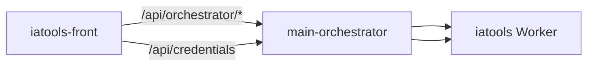

<p align="center">
  
</p>

<h1 align="center">iatools-front</h1>

<p align="center"><strong>Orquestador IA</strong> — rotación de API keys, slots por capacidad, log de eventos y credenciales LLM.</p>

## Arquitectura



[](https://jeff-aporta.github.io/iatools-front/)
[](https://react.dev/)
[](https://github.com/Jeff-Aporta/iatools-back)
[](https://neon.tech/)

## Demo

**https://jeff-aporta.github.io/iatools-front/**

## Vista previa


## Qué hace

- **Estado del orquestador**: slots activos, leases y capacidad por tipo de uso.
- **Log de rotación**: historial reciente de cambios de clave.
- **Credenciales**: listado de keys registradas (requiere sesión).
- **LoginGate** integrado con **system-login**.
- Toggle **orquestador local / producción** → `main-orchestrator.jeffaporta.workers.dev`.

## Metadatos

Icono: `mdi:robot-outline` · tema `#e65100` · [`JeffAppMeta`](https://github.com/Jeff-Aporta/front-shared/blob/main/cdn/isa/js/core/app-meta.js).

## Desarrollo local

```bash
npx serve .
# main-orchestrator en :8780
```

## Repos relacionados

| Repo | Rol |
|------|-----|
| [iatools-back](https://github.com/Jeff-Aporta/iatools-back) | API Worker Cloudflare |
| [iatools-front](https://github.com/Jeff-Aporta/iatools-front) | Este panel (GH Pages) |

MIT · [Jeff-Aporta](https://github.com/Jeff-Aporta)
